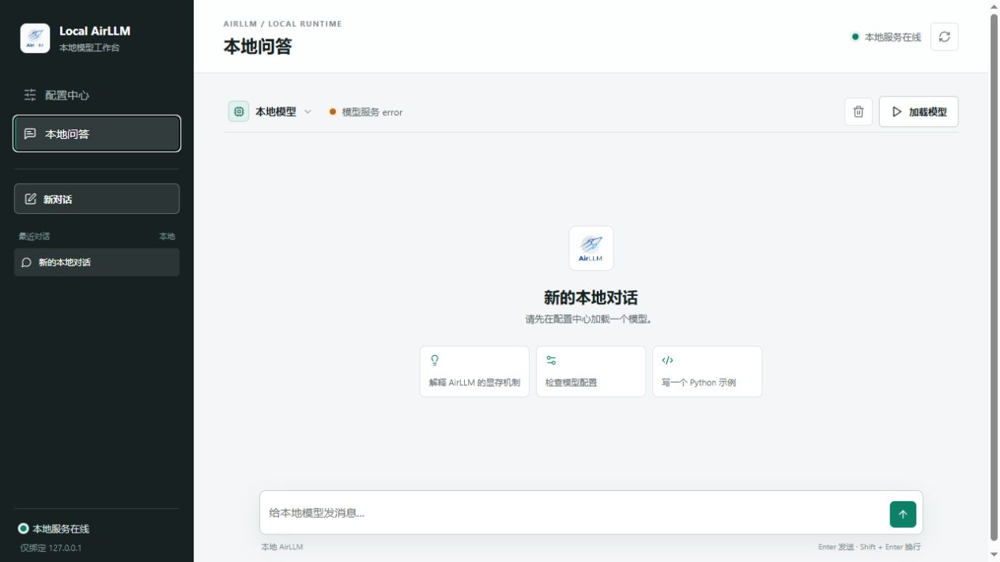

# AirLLM WebUI

**English** | [简体中文](README.zh-CN.md)

A Windows-first local management and chat interface for [AirLLM](https://github.com/lyogavin/airllm). Use the browser to detect Python, create a virtual environment, install PyTorch/AirLLM, prepare a Hugging Face model, and chat with the local model.



> AirLLM WebUI is an independent community project. It is not affiliated with or endorsed by the AirLLM project.

## Features

- Double-click `start.bat` to start the local service and open the browser.
- Choose a Python executable and detect Python, pip, PyTorch, AirLLM, CUDA, and GPU information.
- Create a project-specific `.venv` without modifying the system Python environment.
- Selectively install PyTorch, AirLLM, and bitsandbytes with background task logs.
- Configure a Hugging Face mirror, HTTP/HTTPS proxies, access token, cache directory, and AirLLM shard directory.
- Show model download, shard preparation, and model loading progress.
- GPT-style local chat with streamed response chunks, new chats, quick prompts, Enter-to-send, and Shift+Enter for new lines.
- Stop an in-progress generation from the chat composer; the partial response is kept in the conversation.
- Switch the web UI between Chinese and English; the choice is saved locally.
- Bind both the main service and inference worker to `127.0.0.1` by default.

## Quick Start

1. Install Windows Python 3.10 or newer.
2. Double-click `start.bat`.
3. In **Configuration**, choose the Python executable and click **Detect environment**.
4. Optional: click **Create virtual environment**.
5. Select the dependencies to install and click **Install selected packages**.
6. Set a model ID such as `Qwen/Qwen3-0.6B`, then click **Download and prepare model**.
7. Click **Load model** and open **Local chat**.

The first model download can take a long time and require significant disk space. AirLLM downloads the Hugging Face weights first and then creates layer shards locally.

## Project Layout

```text
airllm-webui/
├─ start.bat                 # Windows launcher
├─ server.py                 # Config API, static files, and task management
├─ app_core.py               # Environment detection, install tasks, and workers
├─ model_prepare.py          # Model preparation in the target Python environment
├─ inference_worker.py       # AirLLM inference worker
├─ frontend/                 # Browser UI
├─ docs/preview.png          # GitHub preview image
└─ data/                     # Local runtime data; models and tokens are ignored
```

## Requirements

- Windows 10 or Windows 11
- Python 3.10+
- NVIDIA GPU is optional; CPU mode is supported but usually slower
- CUDA mode requires a compatible NVIDIA driver and PyTorch wheel
- Runtime dependencies are installed into the selected Python environment from the Configuration page

## Security and Privacy

- The service listens on `127.0.0.1` by default and is not exposed to the LAN.
- The Hugging Face token is stored in the local `data/config.json` file and is not sent by the frontend to a third-party service.
- `.gitignore` excludes tokens, virtual environments, model caches, shards, and task runtime data.
- Do not commit `data/config.json`, model directories, or `.venv` to a public repository.

## License

Apache License 2.0. See [LICENSE](LICENSE). Third-party dependency and asset notices are in [THIRD_PARTY_NOTICES.md](THIRD_PARTY_NOTICES.md).
